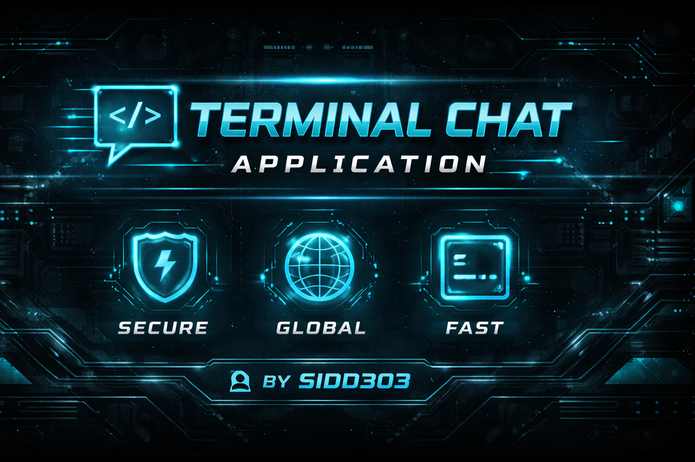
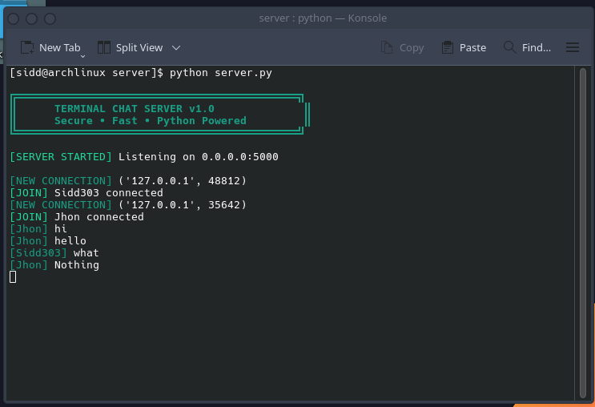
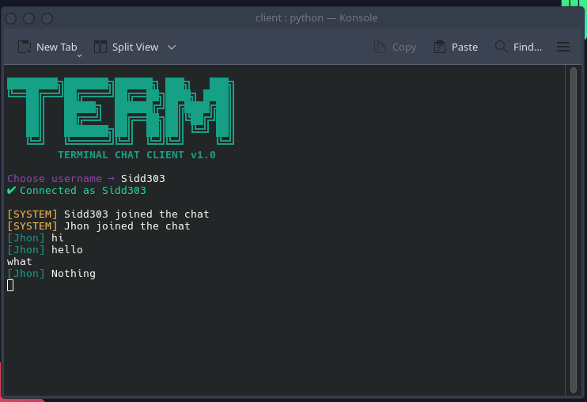
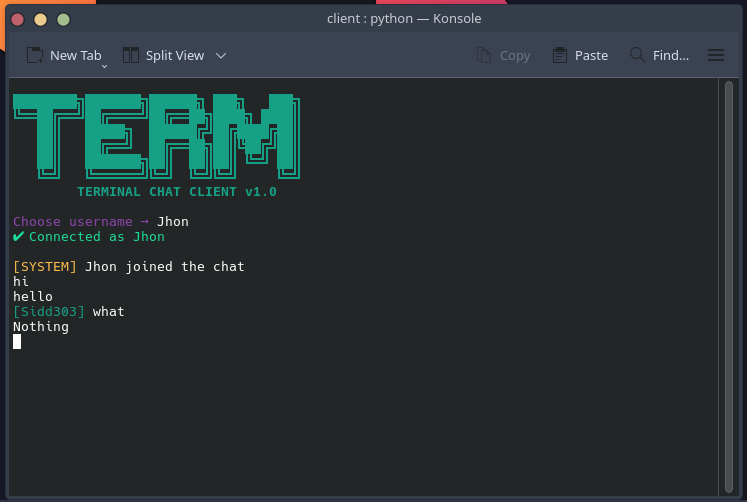

# 🖥️ Terminal Chat Application 💬

A **tech-styled, terminal-based chat application** built using **Python sockets & threading**, allowing multiple users to chat in real time through the command line with a clean, colorful UI.

This project focuses on **low-level networking**, **concurrency**, and **terminal UX design**, and will later support **global access without exposing real IPs**.

---

## ✨ Features

### ✅ Implemented
- 🔌 Client–Server architecture
- 🧵 Multi-client support (threading)
- 👤 Username system
- 🎨 Colorful, modern terminal UI
- 📢 Join / leave notifications
- ⌨️ `/quit` command
- 📟 Tech-style ASCII banners

### 🔜 Planned
- 🏠 Chat rooms (create / join)
- 🌍 Global access (Ngrok / Cloudflare Tunnel)
- 🔐 Optional encryption
- 📜 Command system (`/users`, `/rooms`)
- 🧠 Better error handling

---

## 📁 Project Structure


terminal-chat/
│
├── server/
│   └── server.py        # Chat server
│
├── client/
│   └── client.py        # Chat client
│
├── assets/
│   ├── server.png       # Server UI output
│   ├── client1.png      # Client 1 output
│   └── client2.png      # Client 2 output
│
├── app.py               # (Future use)
├── .gitignore
└── README.md


---

## 🖼️ Application Output

### 🖥️ Server Console


### 💻 Client 1


### 💻 Client 2


---

## 🛠️ Requirements

- Python **3.8+**
- Works on:
  - Linux
  - macOS
  - Windows

> No external libraries required — uses **Python standard library only**

---

## ▶️ How to Run (Local)

### 1️⃣ Start the Server
```bash
cd server
python server.py
````

### 2️⃣ Start a Client

```bash
cd client
python client.py
```

> Open multiple terminals to simulate multiple users.

---

## 🎨 UI Preview (Features)

* Colored usernames
* System messages highlighted
* Clear banners for server & client
* Clean real-time message flow

Example message format:

```
[username] Hello world!
```

---

## 🌍 Global Usage (Upcoming)

The server will be exposed **globally** using tunneling solutions **without revealing private or public IPs**:

* Ngrok
* Cloudflare Tunnel
* Reverse SSH

---

## 👨‍💻 Author

* **Username:** Sidd303
* **Email:** [sidd.laau@gmail.com](mailto:sidd.laau@gmail.com)

---

## 📄 License

This project is **open-source** and free to use for **learning and educational purposes**.

---

## ⭐ Support

If you like this project:

* ⭐ Star the repository
* 🍴 Fork it
* 🧪 Experiment with new features


---

## ✅ Next Suggested Step

🔥 **Next feature to implement (recommended order):**

1️⃣ Chat rooms (create / join)  
2️⃣ `/users` & `/rooms` commands  
3️⃣ Global tunneling (Ngrok / Cloudflare)  

Say **“NEXT”** and I’ll help you implement **room system step-by-step with clean UI** 🚀

